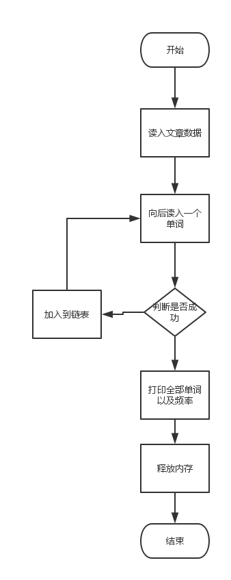

# WordAnalysis

##【需求分析】
###功能需求分析：  
从已知文档中读取文本，最后在屏幕上显示出现的所有不重复的单词以及出现次数。
###业务逻辑： 

 
##【系统设计】
###数据存储结构：   
将每个单词以及出现的频率存入一个结构体中，并将结构体组成链表  

###实例：  
typedef struct word  
{  
char *str;  //存储单词  
int count;  //存储频率  
struct word *pNext;   //指向下一个结构体节点  
}WordNode;  

##【重要逻辑注释】
###重要函数：  
int getNextWord(FILE *fp, char *buf);       //读入下一个单词  
void addWord(char *pWord);              //将单词加入链表  
void print();                            //在屏幕上打印  
WordNode* createWordNode(char *word);   //创建新的单词节点  

##【附录】
+ 统计文章存储在"article.txt"文件中  
+ images文件夹存储说明图  
+ 工作环境：code blocks 16.01，GNU GCC compiler 
